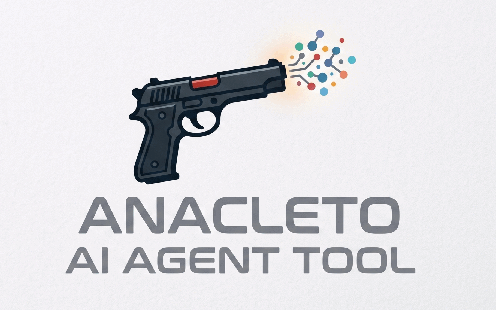

<div align="center">



# Anacleto

**Agent orchestration engine in Rust** — a terminal-first way to run trees of
agents and subagents, with clean separation of skills, tools, MCP servers,
and permissions.

[](https://crates.io/crates/anacleto)
[](https://crates.io/crates/anacleto)
[](https://docs.rs/anacleto)
[](https://github.com/atareao/anacleto/actions/workflows/ci.yml)
[](https://codecov.io/gh/atareao/anacleto)
[](https://github.com/atareao/anacleto/blob/main/LICENSE)
[](https://github.com/atareao/anacleto/blob/main/rust-toolchain.toml)

[Quickstart](#quickstart) • [Features](#features) • [Architecture](#architecture) •
[Configuration](#configuration) • [Development](#development) • [Contributing](#contributing)

</div>

> [!WARNING]
> Anacleto is in **early development**. The core architecture is stable, but
> the APIs and configuration schema may change without notice. Do not rely on
> it in production yet.

---

## Table of contents

- [Why Anacleto?](#why-anacleto)
- [Features](#features)
- [Quickstart](#quickstart)
  - [1. Install](#1-install)
  - [2. Configure](#2-configure)
  - [3. Run](#3-run)
- [Architecture](#architecture)
  - [Module layout](#module-layout)
  - [Design decisions](#design-decisions)
- [Configuration](#configuration)
  - [Models](#models)
  - [LLM provider resolution](#llm-provider-resolution)
  - [Agents](#agents)
  - [Sessions](#sessions)
  - [Extra settings](#extra-settings)
- [Slash commands](#slash-commands)
- [Development](#development)
  - [Dependencies](#dependencies)
- [Project status](#project-status)
  - [Roadmap](#roadmap)
- [Contributing](#contributing)
- [Support](#support)
- [License](#license)

---

## Why Anacleto?

Running a single LLM conversation is easy. Orchestrating **a tree of agents** that
collaborate on a complex task — each with its own skills, tools, MCP servers,
and permissions — is not. Anacleto is a developer-first, terminal-native engine
that makes that orchestration explicit and composable:

- **Terminal-first.** No web UI, no browser tab — just a fast ratatui interface
  that runs in the same process as the engine.
- **Real separation of concerns.** Skills, tools, MCP servers, and permissions
  are configured per agent, not bundled into the engine.
- **Provider-agnostic.** Talk to Claude, GPT, Gemini, AWS Bedrock, Azure OpenAI,
  OpenRouter, or a fully local Ollama model behind a single interface.
- **Extensible.** A plugin system with hooks, custom tools, and custom slash
  commands.
- **Resilient by default.** Streaming, resumable sessions, prompt caching, and
  retries with exponential backoff are built in from day one.

---

## Features

- **Agent orchestration** — root agents delegate tasks to disposable subagents
  through a simple lifecycle: *create → work → reply → destroy*. Subagents
  cannot nest; they are fully independent of their parent. Multiple **root
  agents** are supported.
- **Agents as Markdown** — each agent is a Markdown file with YAML frontmatter
  holding the structural config and the body as the system prompt (the same
  format skills use).
- **Structured tools** — built-in tools with strict JSON schemas:
  `read`, `grep`, `glob`, `webfetch`, `websearch`, `lsp_query` (Language Server
  Protocol), and MCP resource tools.
- **Skills** — Markdown + YAML frontmatter skills in the
  [Anthropic format], loaded dynamically from the filesystem per agent.
- **MCP integration** — Model Context Protocol clients over [stdio or TCP]
  transports, referenced declaratively in config.
- **Multi-LLM** — Anthropic (Claude), OpenAI (GPT), OpenRouter, AWS Bedrock,
  Azure OpenAI, Google Gemini, and Ollama (fully local models).
- **Prompt caching** — provider-aware caching breakpoints with an `auto`/`off`
  mode and per-provider cost tracking.
- **Extended thinking** — configurable Anthropic extended-thinking budget per
  provider.
- **Permissions** — allow-by-default / deny-explicitly model with rules
  configurable per agent (`fs.*`, `net.http`, `command.run`, `mcp.use`,
  `env.read`, `skill.use`).
- **Plugins** — declarative plugin system with hooks
  (`on_agent_spawn`, `on_tool_call`, `on_command`, `on_event`) and custom tool
  registration, loaded from `~/.config/anacleto/plugins/`.
- **Custom slash commands** — user-defined commands with `{env}`/`{file}`
  templating.
- **Hooks** — configurable shell commands that fire at lifecycle points
  (before/after tool execution, apply_patch, shell commands, filesystem writes,
  and engine start/stop) with template variable substitution.
- **TUI** — a ratatui-based terminal interface with a keymap, which-key
  menu, toasts, model picker, and diff viewer, running in the same process as
  the engine.
- **Window navigation** — switch between the Chat, MCPs, Skills, Agents, and
  Input windows with `Alt+1`..`Alt+5`, and navigate each with Vim-style
  bindings (`j`/`k`, `gg`/`G`, `Home`/`End`, `PageUp`/`PageDown`).
- **Shell-style input editing** — the Input box supports the usual terminal
  editing shortcuts (word jumps, `Ctrl+A/E/U/W/K`, `Home`/`End`, history,
  tab-completion) and never lets a shortcut interrupt your typing.
- **Session persistence** — SQLite via sqlx; sessions are resumable across
  restarts, with fork/import/export and snapshot/rollback.
- **Background jobs** — long-running work can be delegated to background jobs.
- **Resilience** — exponential backoff with jitter for LLM, MCP, and subagent
  retries.
- **Configurable context window** — a per-agent history limit, 50% of the model
  window by default, plus a `max_steps` turn cap.

[Anthropic format]: https://docs.anthropic.com/en/docs/build-with-claude/tool-use
[stdio or TCP]: https://github.com/modelcontextprotocol/modelcontextprotocol

---

## Quickstart

### 1. Install

Install from [crates.io](https://crates.io/crates/anacleto):

```sh
cargo install anacleto
```

Or build from source:

```sh
git clone https://github.com/atareao/anacleto.git
cd anacleto
cargo install --path .
```

> [!TIP]
> You need **Rust ≥ 1.85** (edition 2024). Check with `rustc --version`.

### 2. Configure

Create the global config for your machine:

```sh
mkdir -p ~/.config/anacleto/
cp docs/example-global-config.yaml ~/.config/anacleto/config.yaml
```

API keys are read from environment variables using `${VAR}` syntax. Export them
before running:

```sh
export ANTHROPIC_API_KEY="sk-..."
export OPENAI_API_KEY="sk-..."
```

> [!WARNING]
> API keys are sensitive credentials. Use environment variables or a secrets
> manager — never commit keys to your repository or config files.

Optionally add a **project-level config** at `.agents/config.yaml` that merges
on top of the global config.

### 3. Run

```sh
anacleto
```

CLI flags:

| Flag | Description |
|---|---|
| `-c`, `--config <PATH>` | Path to a project config file (overrides auto-detection) |
| `-d`, `--database <PATH>` | Database path (overrides config) |
| `-v`, `--verbose` | Enable debug-level logging |
| `--debug` | Show LLM request/response payloads in the TUI |

See [`docs/user-guide.md`](docs/user-guide.md) for a full walkthrough, or
[`docs/example.md`](docs/example.md) for an end-to-end example.

---

## Architecture

Anacleto is a single binary: the TUI and the orchestration engine run in the
same process on separate Tokio tasks. Agents are **in-process async tasks**, not
subprocesses — identity is decoupled from OS processes.

### Module layout

```
src/
├── main.rs            # Entrypoint, CLI argument parsing (clap)
├── lib.rs             # Crate root — re-exports all modules
├── agent/             # Agent model
│   ├── lifecycle.rs   #   AgentHandle, spawn_agent (main loop)
│   ├── session.rs     #   AgentSession, process, LLM loop
│   ├── tools.rs       #   Tool definitions & execution
│   ├── context.rs     #   Context compaction / summarization
│   ├── loader.rs      #   Markdown frontmatter loading
│   └── retry.rs       #   Retry policy
├── config/            # YAML config parsing, global + project merge, paths
├── db/                # SQLite persistence via sqlx
│   ├── session.rs     #   Session CRUD
│   ├── messages.rs    #   Message storage
│   ├── todos.rs       #   Todo items
│   ├── snapshots.rs   #   Snapshots
│   ├── export.rs      #   Export / import
│   └── usage.rs       #   Model usage tracking
├── engine/            # Orchestration loop
│   ├── orchestrator.rs#   Engine core
│   ├── sessions.rs    #   Session commands
│   ├── commands.rs    #   Slash command handlers
│   ├── events.rs      #   Event / command types
│   ├── jobs.rs        #   Background jobs
│   ├── apply_patch.rs #   apply_patch tool
│   └── template.rs    #   Templates
├── error.rs           # Global error types (thiserror)
├── hook/              # Hook system — configurable shell commands at lifecycle points
├── llm/               # LLM providers
│   ├── provider.rs    #   LlmProvider trait + factory
│   ├── openai.rs      #   OpenAI / OpenRouter
│   ├── anthropic.rs   #   Anthropic (Claude)
│   ├── ollama.rs      #   Ollama (local)
│   ├── azure.rs       #   Azure OpenAI
│   ├── bedrock.rs     #   AWS Bedrock
│   ├── google.rs      #   Google Gemini
│   ├── models.rs      #   Model catalog types
│   └── template.rs    #   Prompt templates
├── lsp/               # Language Server Protocol queries
│   ├── mod.rs         #   LspClient
│   └── format.rs      #   Result formatting
├── mcp/               # MCP client (JSON-RPC 2.0 over stdio/TCP)
│   ├── client.rs      #   McpClient
│   ├── registry.rs    #   McpRegistry
│   ├── parse.rs       #   Response parsing
│   └── types.rs       #   Types
├── plugin/            # Plugin system with hooks and custom tool registration
├── shell/             # Shell command execution + modern CLI tool inventory
├── skill/             # Skill loading (Anthropic Markdown format), execution
├── tools/             # Structured agent tools (read, grep, glob, web, lsp, mcp, search_symbol)
└── tui/               # ratatui + crossterm interface
    ├── app.rs         #   App state + run loop
    ├── events.rs      #   Event handling
    ├── keys.rs        #   Key routing
    ├── input.rs       #   Input editing
    ├── navigation.rs  #   Window navigation (Vim)
    ├── keymap.rs      #   Keymap + actions
    ├── keyparse.rs    #   Key parsing / formatting
    ├── render.rs      #   Rendering
    ├── palette.rs     #   Command / agent / model pickers
    ├── markdown.rs    #   Markdown rendering helpers
    ├── theme.rs       #   Themes
    ├── model_picker.rs#   Model picker
    ├── diff_viewer.rs #   Diff viewer
    ├── which_key.rs   #   Which-key popup
    └── toast.rs       #   Toasts
```

### Design decisions

The project follows [Architecture Decision Records (ADRs)](docs/adr/); all eight
are summarized here.

| ADR | Decision |
|---|---|
| [ADR-0001](docs/adr/ADR-0001-agent-model.md) | Agents and subagents are the same type; subagents are disposable and cannot nest. |
| [ADR-0002](docs/adr/ADR-0002-skill-system.md) | Skills are Markdown + YAML frontmatter (Anthropic format), loaded dynamically. |
| [ADR-0003](docs/adr/ADR-0003-mcp-integration.md) | MCP is consumed via JSON-RPC 2.0 over stdio or TCP; consumer-only. |
| [ADR-0004](docs/adr/ADR-0004-tui-architecture.md) | ratatui + crossterm in the same process as the engine (separate Tokio tasks). |
| [ADR-0005](docs/adr/ADR-0005-configuration-system.md) | YAML. Global (`~/.config/anacleto/`) + project (`.agents/`) merged. |
| [ADR-0006](docs/adr/ADR-0006-persistence.md) | SQLite via sqlx. Sessions resumable; context limit 50% of model window. |
| [ADR-0007](docs/adr/ADR-0007-permissions-model.md) | Allow by default, deny explicitly; human approval for sensitive ops. |
| [ADR-0008](docs/adr/ADR-0008-technology-stack.md) | Rust edition 2024, Tokio, ratatui, sqlx, reqwest, serde. |

---

## Configuration

Two layers of YAML configuration are merged at startup:

- **Global** — `~/.config/anacleto/config.yaml`, machine-wide defaults for all
  projects.
- **Project** — `.agents/config.yaml` in the project root, merged on top of
  the global config.

### Models

Each provider you configure becomes available to agents. API keys support
`${VAR}` environment-variable interpolation and only providers you configure
are enabled (Ollama always has a default):

```yaml
models:
  anthropic:
    api_key: "${ANTHROPIC_API_KEY}"
    model: "claude-sonnet-4-20250514"
    context_window: 200000

  openai:
    api_key: "${OPENAI_API_KEY}"
    model: "gpt-4o"
    context_window: 128000

  openrouter:
    api_key: "${OPENROUTER_API_KEY}"
    model: "openai/gpt-4o"
    context_window: 128000
    base_url: "https://openrouter.ai/api/v1"

  ollama:
    base_url: "http://localhost:11434"
    model: "llama3.2"
    context_window: 8192

  bedrock:
    api_key: "${AWS_ACCESS_KEY_ID}"
    model: "anthropic.claude-sonnet"
    context_window: 200000

  azure:
    api_key: "${AZURE_OPENAI_API_KEY}"
    model: "gpt-4o"
    context_window: 128000
    base_url: "https://<resource>.openai.azure.com/"

  google:
    api_key: "${GOOGLE_API_KEY}"
    model: "gemini-2.0-flash"
    context_window: 200000

  cache:
    mode: auto   # or "off"
```

### LLM provider resolution

Model names are matched to providers via prefix rules in the engine:

| Pattern | Provider |
|---|---|
| Starts with `claude` | Anthropic |
| Starts with `gpt`, `o1`, or `o3` | OpenAI |
| Contains `/` | OpenRouter (OpenAI-compatible) |
| Anything else | Ollama |

Vendor-specific providers (Bedrock, Azure, Google) are configured explicitly
in the `models` section and referenced by their model name.

### Agents

> [!IMPORTANT]
> Agents are **no longer defined in `config.yaml`**. Each agent is a
> self-contained Markdown file with YAML frontmatter, located in the
> `agents/` directory:
> - global: `~/.config/anacleto/agents/*.md`
> - project: `.agents/agents/*.md`
>
> The frontmatter holds the structural config and the Markdown body is the
> system prompt. Project agents override global agents with the same name.
> Exactly one agent must declare `role: root`.

Example (`.agents/agents/root.md`):

```markdown
---
name: root
description: Senior engineering agent
role: root
model: "claude-sonnet-4"
skills:
  - .agents/skills/shell/
mcps: []
permissions:
  deny:
    - "command.run.sudo"
subagents:
  - reviewer
  - writer
max_steps: 90
---

You are **Anacleto** ...
```

Supported frontmatter fields:

| Field | Description |
|---|---|
| `name` | Unique agent name |
| `description` | Short human-readable summary |
| `role` | `root` or `subagent` (default `subagent`) |
| `model` | Model name resolved to a provider |
| `skills` | Skill paths |
| `mcps` | MCP server names |
| `permissions` | `allow`/`deny` lists |
| `subagents` | Subagent names (roots only) |
| `max_steps` | Maximum LLM+tool turns per task |

> [!NOTE]
> Subagents are fully independent — they do not inherit skills, MCPs, or
> permissions from their parent.

### Sessions

```yaml
session:
  history_limit_percent: 50   # % of context window for history
  database_path: "~/.local/share/anacleto/sessions.db"
  max_steps: 90              # default turn cap per task
  debug: false               # show LLM payloads in the TUI
  retry:
    max_retries: 3
    base_delay_ms: 1000
    max_delay_ms: 30000
```

Retries use exponential backoff with jitter:

```
delay = min(base_delay × 2^attempt × random(0.75, 1.25), max_delay)
```

### Extra settings

- **`shell.tools`** — override or extend the built-in catalog of modern CLI
  tools (`bat`, `fd`, `rg`, `sd`, ...) that the agent is told to prefer.
- **`keymap`** — override TUI keybindings. Every shortcut (global actions,
  input editing, and Vim navigation in Chat/panels) is rebindable via
  `keymap.bindings`, mapping an action name to a list of key strings
  (e.g. `quit: ["ctrl+q"]`, `cursor_word_left: ["ctrl+left", "alt+left"]`).
  Window switching is bound to `Alt+1`..`Alt+5` by default
  (`focus_chat`, `focus_mcps`, `focus_skills`, `focus_agents`, `focus_input`).
  See `docs/example-global-config.yaml` for the full list of action names.
- **`editor`** — external editor command (overrides `$EDITOR`/`$VISUAL`).
- **`model_picker`** — model picker dialog configuration.
- **`workspaces`** — known workspace directories for the `/workspaces` command.
- **`commands`** — custom slash commands with `{env}`/`{file}` templating.

### Hooks

Hooks are shell commands that fire automatically at specific points in the
agent lifecycle. They are defined at the top level of your config and run
**fire-and-forget**: their output is logged but does not affect execution.

```yaml
hooks:
  # After every apply_patch batch, sync the codegraph index
  after_apply:
    - type: shell
      command: "codegraph sync"
      timeout_secs: 60

  # On engine startup
  on_startup:
    - type: shell
      command: "echo 'Engine started'"

  # Before every shell command executed by the agent
  before_shell:
    - type: shell
      command: "echo 'Running: {{shell_command}}' >> /tmp/anacleto-hooks.log"
```

#### Hook points

| Hook point | Fires when | Context variables |
|---|---|---|
| `before_tool` | Before any tool execution | `{{tool_name}}`, `{{agent_name}}` |
| `after_tool` | After any tool execution | `{{tool_name}}`, `{{agent_name}}` |
| `before_apply` | Before `apply_patch` | `{{tool_name}}`, `{{agent_name}}` |
| `after_apply` | After `apply_patch` success | `{{tool_name}}`, `{{agent_name}}` |
| `before_shell` | Before shell command | `{{tool_name}}`, `{{shell_command}}`, `{{agent_name}}` |
| `after_shell` | After shell command success | `{{tool_name}}`, `{{shell_command}}`, `{{agent_name}}` |
| `before_fs_write` | Before file write/edit/delete | `{{tool_name}}`, `{{file_path}}`, `{{agent_name}}` |
| `after_fs_write` | After file write/edit/delete success | `{{tool_name}}`, `{{file_path}}`, `{{agent_name}}` |
| `on_startup` | Engine startup | — |
| `on_shutdown` | Engine shutdown | — |

Each hook has a configurable timeout (default 30 s). When a command times out
it is killed and reported as a warning in the logs.

---

## Slash commands

The TUI ships with an extensive set of slash commands. Highlights:

| Area | Commands |
|---|---|
| **Agents** | `/agents`, `/agent`, `/subagents`, `/skills`, `/mcps` |
| **Models** | `/models` |
| **Sessions** | `/resume`, `/delete`, `/rename`, `/fork`, `/export`, `/import`, `/share`, `/unshare`, `/timeline`, `/parent`, `/children` |
| **Edit/undo** | `/undo`, `/redo`, `/stash` |
| **Snapshots** | `/snapshot`, `/revert`, `/stage`, `/clear`, `/commit` |
| **Context** | `/compact`, `/debug` |
| **Build & jobs** | `/build`, `/jobs` |
| **Workspace** | `/warp`, `/workspaces`, `/move`, `/worktree` |
| **TUI/UX** | `/themes`, `/timestamps`, `/thinking`, `/editor`, `/ee`, `/copy`, `/export-editor` |
| **Misc** | `/review`, `/init`, `/status`, `/exit` |

> Run `/help` in the TUI to list all commands. Custom slash commands can be
> added through the `commands` config key.

---

## Development

```sh
cargo build    # debug build
cargo test     # run all tests
cargo clippy   # lint
cargo fmt      # format
```

Run these before committing:

```sh
cargo fmt --check && cargo clippy && cargo test
```

### Dependencies

| Crate | Purpose |
|---|---|
| `tokio` | Async runtime |
| `ratatui` + `crossterm` | TUI |
| `serde` + `serde_yaml` | Serialization |
| `sqlx` | SQLite (async) |
| `reqwest` | HTTP client for LLM APIs |
| `tower` | Middleware (retries, rate limiting) |
| `clap` | CLI argument parsing |
| `anyhow` + `thiserror` | Error handling |
| `futures` + `tokio-stream` | Async streams |
| `uuid` | Session/agent ID generation |
| `tracing` | Structured logging |
| `chrono` | Date/time |
| `rand` | Jitter for retry backoff |
| `unicode-width` | TUI text width |

---

## Project status

Active development. The core architecture is stable; APIs and the configuration
schema may change.

### Roadmap

Evolution phases ([`PLAN.md`](PLAN.md)), with phases 1–12 now complete:

- [x] **FASE 1** — orchestration (`delegate` tool, background jobs, session tree)
- [x] **FASE 2** — context & memory (compaction, truncation)
- [x] **FASE 3** — structured tools (`apply_patch`, `read`, `grep`, `glob`) & MCP
- [x] **FASE 4** — TUI/UX (keymap, which-key, toasts, diff viewer)
- [x] **FASE 5** — sessions & workflow (diff viewer, snapshots)
- [x] **FASE 5.5** — active agent switching
- [x] **FASE 6** — LLM providers, prompt caching, extended thinking
- [x] **FASE 7** — extensibility (plugins, custom slash commands)
- [x] **FASE 8** — window navigation (`Alt+1`..`Alt+5`) and per-window bindings
- [x] **FASE 9** — fully configurable keybindings
- [x] **FASE 10** — input that never interrupts typing
- [x] **FASE 11** — split `app.rs` into cohesive modules
- [x] **FASE 12** — split large files into cohesive modules
- [x] **FASE 13** — hook system (configurable shell commands at lifecycle points)
- [ ] MCP server lifecycle management
- [ ] Skill marketplace

---

## Contributing

Contributions are welcome! Please review the
[`AGENTS.md`](AGENTS.md) for the project's conventions,
[`TODO.md`](TODO.md) for known gaps, the [`docs/`](docs/) directory for
design context, and [`PLAN.md`](PLAN.md) for the evolution plan.

Before opening a pull request, make sure the project is clean:

```sh
cargo fmt --check && cargo clippy && cargo test
```

High-level guidelines:

- **Edge cases first** — this is agent tooling; think hard about failure modes.
- **No heavy dependencies** — prefer the standard library or the crates listed
  in [`Cargo.toml`](Cargo.toml).
- **Document decisions** — non-obvious trade-offs belong in an ADR under
  [`docs/adr/`](docs/adr/).
- **Keep the TUI sole interface** — do not add a web UI or batch mode.

---

## Support

- 📖 **Docs** — [`docs/user-guide.md`](docs/user-guide.md), the
  [`docs/glossary.md`](docs/glossary.md), and an
  [end-to-end example](docs/example.md).
- 🗂️ **Architecture records** — [`docs/adr/`](docs/adr/).
- 🗺️ **Evolution plan** — [`PLAN.md`](PLAN.md).
- 🐛 **Bugs & feature requests** — open an
  [issue](https://github.com/atareao/anacleto/issues).

---

## License

Licensed under the [MIT License](LICENSE). Copyright (c) 2026 atareao.
